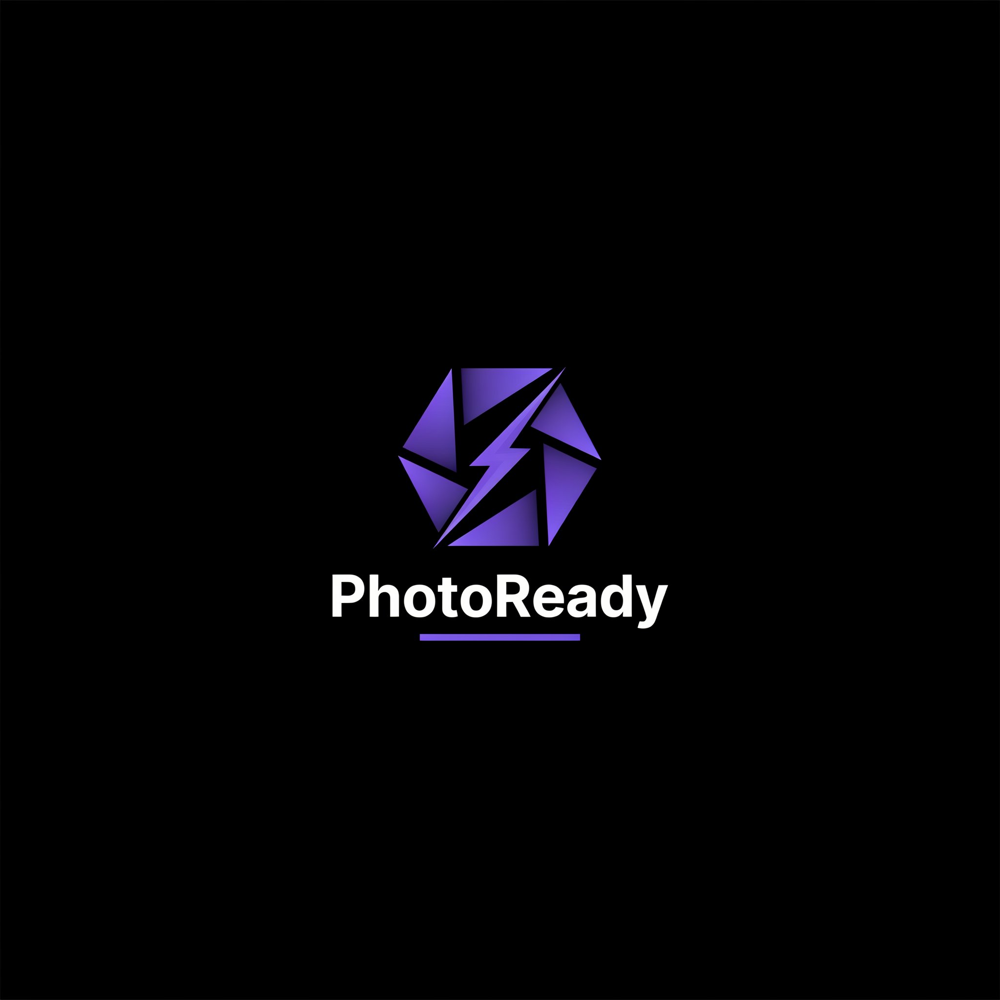

<div align="center">
  
  <h1>📸 PhotoReady - Mega Compressor</h1>
  <p><b>The Ultimate Client-Side Photo Compressor & Date Adder for Government Exams</b></p>
  
  [](https://orbitwebtools.github.io/PhotoReady/)
  [](https://opensource.org/licenses/MIT)
  [](http://makeapullrequest.com)
  []()
</div>

---

## 🚀 Overview

**PhotoReady** is a blazing-fast, privacy-first web application designed specifically to help millions of Indian students prepare their documents for government exam form fill-ups (SSC, UPSC, Banking, Railway, etc.). 

Strict document guidelines often result in rejected applications. PhotoReady solves this by allowing users to **compress images to 20KB, 50KB, or 100KB**, resize dimensions, and automatically append the **Date of Photo (DOP)**—all directly within their web browser. 

**Zero server uploads. 100% Privacy.**

👉 **[Live Demo: Try PhotoReady Now!](https://orbitwebtools.github.io/PhotoReady/)**

---

## ✨ Features That Scale to Millions

*   **🔒 100% Client-Side Processing:** Built using the HTML5 Canvas API. Your sensitive documents (Photos, Signatures, IDs) never leave your device.
*   **🎯 Smart Target Compression:** Hit exact file sizes (e.g., under 20KB for signatures, under 50KB for photos) with our live real-time quality slider.
*   **📅 Automated Date Adder:** Perfectly aligns your Name and Date of Photo (DOP) at the bottom of the image, compliant with SSC CGL and UPSC 2026 guidelines.
*   **🎨 Premium UI/UX:** Built with Tailwind CSS and a beautiful Glassmorphism design system. Fully responsive for mobile and desktop users.
*   **⚡ 1-Click Presets:** Pre-configured dimension and quality settings for SSC, Signatures, and standard documents.

---

## 🛠️ Tech Stack

This project is lightweight, fast, and does not require a backend.

*   **Markup:** HTML5
*   **Styling:** Tailwind CSS (via CDN for rapid prototyping/development) + Custom CSS variables
*   **Logic:** Vanilla JavaScript (ES6+)
*   **Engine:** HTML5 `<canvas>` API for image manipulation
*   **Typography:** Google Fonts (Plus Jakarta Sans & Space Grotesk)

---

## 💻 Local Setup & Development

Want to run this tool locally or contribute? It takes less than 10 seconds.

1. **Clone the repository:**
   ```bash
   git clone [https://github.com/orbitwebtools/PhotoReady.git](https://github.com/orbitwebtools/PhotoReady.git)
